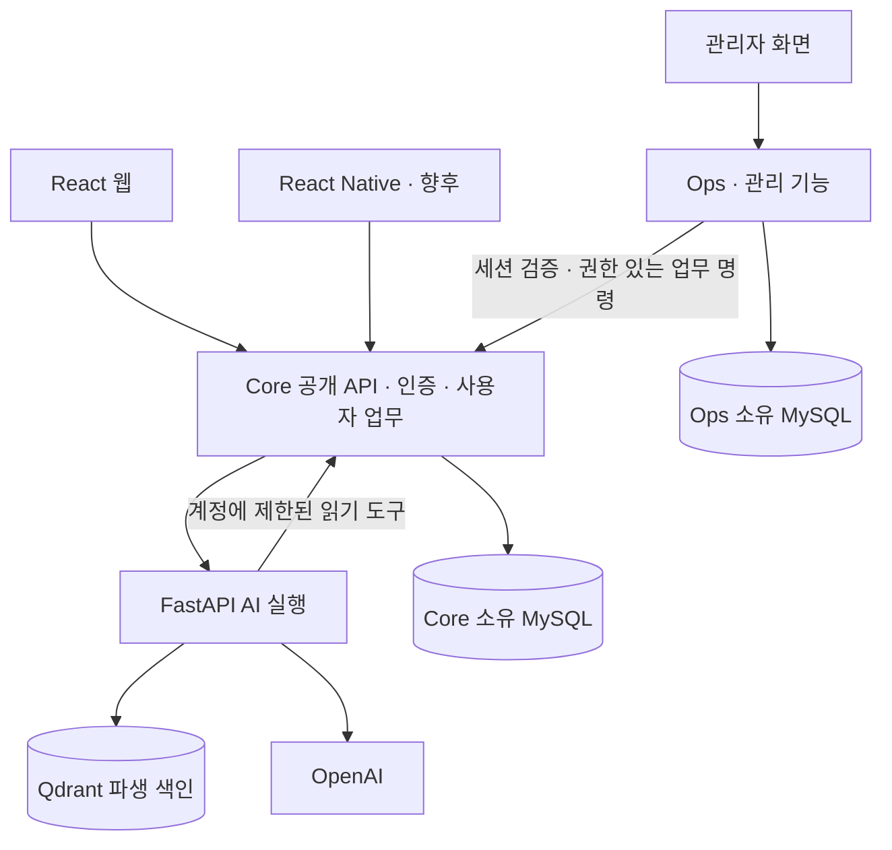

# GovBiz MSA 전환 전략 — GitHub 사례·현재 코드 기반 검토

> 이 문서의 Core API/Core, Catalog, AI Service/AI, Ops는 당시 표기입니다. 현재 서비스명은 각각
> `core-service`, `catalog-service`, `ai-service`, `ops-service`입니다. 본문의 검증 수치·이미지 태그·
> 커밋 고정 경로는 당시 기록을 보존하며, 최신 구성은 [메인 README](../README.md)를 따릅니다.

작성일: 2026-09-19

이 문서는 초기 전략 검토 기록이다. 현재 이름은 `GovBiz`이며 웹·모바일·공통 패키지와
`backend/{core-service,catalog-service,ai-service,ops-service}`를 함께 관리한다.
아래의 `GovBiz-app` 별도 저장소 안과 과거 소스 경로는 당시 제안·감사 기준이며 현재 실행 안내가 아니다.
최신 구조와 완료 범위는 [저장소 개요](../README.md)를 따른다.

상태: **MSA·운영 전환은 설계 제안이다.** 이후 사용자가 승인한 저장소 경계는 Ops를 GovBiz-web에 통합하고 GovBiz-infra를 별도 배포 설정 저장소로 유지하는 것이다. 이 저장소 정리는 업무 서비스 추출·Kubernetes·Argo CD 운영 전환을 실행하거나 승인한 것으로 해석하지 않는다. [전환 기록](repository-transition.md)

## 1. 결론과 판단 범위

지금은 서비스별 저장소를 추가하지 않는다. Ops를 포함한 애플리케이션 모노레포에서 **Core의 업무 경계 정리 → Core·AI 독립 릴리스 → 인증 경계가 있는 Ops 최소 기능 → 조건을 만족한 Catalog 추출** 순서로 진행한다. Kubernetes·Argo CD 실습은 별도 배포 트랙으로 다루며, 설치 성공을 MSA 완성으로 간주하지 않는다.

- `GovBiz-web`: React, Core, AI, Django Ops의 애플리케이션 모노레포. 로컬 통합 Compose·검증·Dockerfile도 함께 관리한다.
- `backend/ops/`: GovBiz-web 안에서 별도 운영 관리 책임을 구현할 위치. 현재는 상태 확인 API와 전용 MySQL만 있는 골격이며 Core 프로세스·테이블과 합치지 않는다. 기존 GovBiz-ops 원격 저장소는 삭제·archive하지 않는다.
- `GovBiz-infra`: 향후 승인된 환경별 배포 상태와 Argo CD 정의의 기준 저장소. 애플리케이션 submodule과 로컬 Compose는 관리하지 않는다. 현재는 준비 문서만 있으며 실행 가능한 GitOps 구성이 아니다.
- `GovBiz-app`: React Native 개발 시 추가할 클라이언트 저장소. 새로운 인증·공고·AI 백엔드를 중복 구현하지 않는다.
- `GovBiz-ai`, `GovBiz-auth`, `GovBiz-catalog` 등 추가 저장소는 지금 만들지 않는다.

이 선택은 모든 프로젝트에 모노레포가 우월하다는 결론이 아니라, 이후 비교 검토와 사용자의 Ops 통합 결정을 반영한 것이다. 실제 담당 인원, 독립 운영 조직, 트래픽, 비용 한도, 가용성 목표는 확인되지 않았다. 팀별 접근 제한이나 별도 릴리스 책임이 확인되면 저장소 결정을 재검토할 수 있다. 프론트·백엔드 별도 저장소도 정당한 선택이며 저장소 수로 MSA 여부를 판단하지 않는다.

### 대안 비교와 선택 이유

| 대안 | 이익 | 비용·위험 | 판단 |
| --- | --- | --- | --- |
| 현 구조를 유지하고 기능만 추가 | 가장 적은 전환 작업 | Core·AI 릴리스 결합과 Ops 인증 설계를 미룸 | 단기 운영은 가능하지만 전환 목표를 충족하지 않음 |
| 모노레포 안에서 경계·계약·독립 배포부터 확보 | 기존 데이터와 기능을 보존하면서 분리 효과를 검증 | 경계 테스트·호환 릴리스·책임 정의 필요 | **현재 권장안** |
| 계정·공고·신청·파트너·메일·AI를 즉시 별도 서비스/레포로 분할 | 분리 단위가 겉으로 명확함 | 교차 트랜잭션·인증·여러 PR·배포·복구 비용을 한 번에 부담 | 현재 근거로는 기각 |

포트폴리오의 증명 대상은 서비스 수가 아니라, 선택한 한 경계를 독립 배포하고 실패·중복·되돌리기까지 설명할 수 있는지다. 성능 개선이나 운영 비용 절감을 이미 달성했다고 주장하지 않는다.

### 최초 소스 분석 기준 — 아래 코드 판정의 기준선

| 대상 | 확인한 버전 |
| --- | --- |
| GovBiz-infra | `0c84cc3f86735b9036d617d80349a206bbab4803` + 로컬의 GovBiz-web 서브모듈 이름 변경 |
| GovBiz-web | `34897562fcf16e30f7c811ad29eaa4b305f4f3ef` |
| GovBiz-ops | `611232de21f69689c4024f3935b8d693b03b7777` |

GitHub 사례는 아래 커밋의 파일을 GitHub API로 직접 읽었다. 운영 AWS·Vercel 상태, 운영 DB, 실제 성능·장애 동작은 이번에 조회하거나 실행하지 않았다. 코드에 설정이 있다는 사실과 운영에 적용됐다는 사실을 구분한다.

저장소 통합 이후에도 분석 증거는 위 커밋의 공개 URL로 고정한다. 로컬 submodule 경로가 없어져도 원본을 추적할 수 있도록 하며, 파일 이동만으로 아래 결합이 해소됐다고 표시하지 않는다.

기존 [MSA·Kubernetes 전환안](msa-kubernetes-argocd-plan.md)은 배경 자료다. 해당 문서의 “Catalog 첫 추출 후보”는 확정 일정이 아니며, 이번 문서의 데이터·인증·배포 통과 조건으로 재평가한다.

## 2. GitHub 사례에서 채택할 것과 버릴 것

어떤 저장소도 “모든 시스템에 올바른 MSA 정답”으로 취급하지 않는다. 공식·커뮤니티 참조 구현의 실제 코드를 확인하고, GovBiz에 필요한 성질만 채택한다. 네 저장소 모두 조회 시 archived 상태가 아니었다. 유지 상태가 운영 완성도를 보장하지는 않는다.

### A. dotnet/eShop — 경계와 데이터·이벤트 일관성

기준: `b4a40872005d4bb29e5b1fa1ff7e244143d39215`.

- [AppHost](https://github.com/dotnet/eShop/blob/b4a40872005d4bb29e5b1fa1ff7e244143d39215/src/eShop.AppHost/Program.cs)는 한 저장소에서 Catalog, Ordering, Identity, Basket 등을 별도 실행 구성으로 연결한다. 하나의 Postgres 리소스 아래 기능별 DB를 두고, Ordering API와 그 worker는 같은 Ordering DB를 사용한다.
- [CatalogIntegrationEventService](https://github.com/dotnet/eShop/blob/b4a40872005d4bb29e5b1fa1ff7e244143d39215/src/Catalog.API/IntegrationEvents/CatalogIntegrationEventService.cs)는 Catalog 변경과 이벤트 로그를 같은 로컬 트랜잭션으로 저장하고, 브로커 발행 상태를 별도로 관리한다.
- 채택: 서비스별 데이터 소유권, 로컬 트랜잭션과 이벤트 발행의 구분, worker와 업무 서비스의 구분.
- 비채택: .NET·Aspire로 재작성, 예제 전체 구조 복제, 이벤트 발행이 곧 exactly-once라는 해석. 이 파일만으로 전체 장애 복구가 검증됐다고 판단하지 않는다.
- 한계: [프로젝트 README](https://github.com/dotnet/eShop/blob/b4a40872005d4bb29e5b1fa1ff7e244143d39215/README.md)도 컨테이너 기반 데이터 저장소 배포 구성을 평가·데모용으로 설명한다. 예제 배포 성공을 운영 데이터 보존 설계의 대체물로 삼지 않는다.

### B. Google Online Boutique — 계약 중심 통신, 모노레포의 MSA

기준: `38e7348eb289eb5b87c0c6e8cb19ced0449dc389`.

- [README](https://github.com/GoogleCloudPlatform/microservices-demo/blob/38e7348eb289eb5b87c0c6e8cb19ced0449dc389/README.md)는 여러 언어의 서비스를 한 저장소에서 관리한다. [demo.proto](https://github.com/GoogleCloudPlatform/microservices-demo/blob/38e7348eb289eb5b87c0c6e8cb19ced0449dc389/protos/demo.proto)에 서비스 호출 계약을 명시한다.
- 채택: 실행 단위와 Git 저장소 단위는 다르다는 점, 인터페이스를 먼저 정의하고 소비자·생산자가 검증한다는 점.
- 비채택: 서비스 개수·언어·gRPC·서비스 메시를 그대로 복제. GovBiz는 기존 HTTP/JSON을 유지한다.
- 한계: README상 로그인 없는 세션, JSON 기반 상품 목록, 모의 결제·배송·메일이 포함된다. GovBiz의 실제 계정 폐기·RDS 마이그레이션·유료 LLM 과금 안전성을 증명하는 사례가 아니다.

### C. Spring Petclinic Microservices — 업무 분리와 관측

기준: `3858f9c630cf989bb6809a86edf47c2be78dc9f1`.

- [README](https://github.com/spring-petclinic/spring-petclinic-microservices/blob/3858f9c630cf989bb6809a86edf47c2be78dc9f1/README.md)와 [서비스 모듈 목록](https://github.com/spring-petclinic/spring-petclinic-microservices/blob/3858f9c630cf989bb6809a86edf47c2be78dc9f1/pom.xml)은 Customers, Vets, Visits, GenAI를 나누되 하나의 저장소에 둔다. Config·Discovery·Gateway·관측 구성도 있다.
- 채택: 기술 계층이 아니라 업무 책임으로 나누는 방식, 분산 요청의 관측 필요성.
- 비채택: Kubernetes 전환을 이유로 Eureka·Config Server·별도 Gateway까지 동시에 도입. 기존 Nginx·플랫폼 DNS·환경설정의 부족이 입증됐을 때만 추가한다.
- 한계: 기본 DB는 메모리 DB이며 샘플 데이터 초기화를 전제로 한다. GovBiz의 MySQL 8.4·Flyway·운영 데이터 보존 기준을 대체하지 않는다. 예제의 provider 선택 기능도 현재 OpenAI 필수 정책에 가져오지 않는다.

### D. Spring Modulith — 물리 분리 전에 검증할 경계

기준: `9bd02551749d5485bd52a84c234a48a0a1b9e819`.

- [구조 검증 문서](https://github.com/spring-projects/spring-modulith/blob/9bd02551749d5485bd52a84c234a48a0a1b9e819/src/docs/antora/modules/ROOT/pages/verification.adoc)는 모듈 순환 의존 금지, 내부 구현 직접 접근 금지, 허용 의존성 검사를 설명한다.
- 채택: GovBiz Core 안에서 먼저 의존 방향을 테스트로 고정한다.
- 비채택: 프레임워크 도입 자체를 목표로 삼거나 현재 모든 패키지를 일괄 재배치. 우선 기존 테스트 환경에서 경계 검사를 작성하고, 테스트 도구 추가는 호환성·필요성을 확인한 별도 변경으로 한다.

### 공통 결론

예제들의 공통점은 “서비스 하나당 Git 저장소 하나”가 아니다. 독립 실행 단위·명시적 계약·업무 책임을 갖춘다는 점이다. 반대로 예제의 모노레포 자체가 독립 운영까지 자동 보장하는 것도 아니다.

배포 설정과 소스 저장소를 구분하는 `GovBiz-infra` 방향은 [Argo CD 권고](https://argo-cd.readthedocs.io/en/stable/user-guide/best_practices/#separating-config-vs-source-code-repositories)와 부합한다. 단, 현재 EC2 Compose·CodeBuild 설정은 앱 저장소에 유지한다. 향후 Kubernetes 전환 때 같은 환경·서비스를 양쪽에서 변경하는 두 개의 운영 기준을 만들면 안 된다.

## 3. GovBiz 현재 구조에 대한 엄격한 판정

현재는 **Core 중심의 업무 애플리케이션 + 별도 AI 프로세스 + Ops 골격**이다. 전체 시스템의 독립 배포·장애 격리가 검증된 MSA라고 부르기에는 이르다. 그렇다고 Core 내부 JOIN이나 트랜잭션이 현재 모놀리스 안에서 잘못된 것은 아니다. 물리 분리를 시도할 때 해소할 결합이라는 뜻이다.

| 관찰 | 코드 근거 | 전략상 의미 |
| --- | --- | --- |
| Core·AI는 별도 이미지지만 한 릴리스로 묶임 | [release.py](https://github.com/GovBiz-Team/GovBiz/blob/34897562fcf16e30f7c811ad29eaa4b305f4f3ef/infrastructure/codebuild/release.py), `main()`에서 두 이미지 발행 후 SSM 동시 전달 | 저장소 분리보다 선택적 배포·버전 호환 검증이 먼저 |
| 호스트도 두 이미지에 동일한 Commit을 요구 | [deploy_host.py](https://github.com/GovBiz-Team/GovBiz/blob/34897562fcf16e30f7c811ad29eaa4b305f4f3ef/infrastructure/codebuild/deploy_host.py), `main()`의 이미지 revision 검사 및 `restore_or_start()` | 빌드 경로만 나눠서는 안 됨; SSM 계약·호스트 검증·복구 범위도 서비스별로 변경 |
| 배포 스크립트와 저장소 Compose의 네트워크 전제가 다름 | 같은 호스트 스크립트는 Core proxy IP `172.30.254.3`을 요구하나 [Compose](https://github.com/GovBiz-Team/GovBiz/blob/34897562fcf16e30f7c811ad29eaa4b305f4f3ef/infrastructure/compose.prod.yaml)는 이를 지정하지 않음 | 호스트 전용 패치가 있다는 소스 근거; 실제 운영 드리프트 여부는 미확인. 저장소 파일을 바로 덮어쓰지 않음 |
| 배포 최신 커밋 확인이 이전 개인 저장소 주소를 사용 | 같은 파일의 `is_current_main()` | 새 조직 저장소의 자동 배포가 연결됐다고 가정 금지 |
| Core 초기 기동이 AI healthy를 기다림 | [운영 Compose](https://github.com/GovBiz-Team/GovBiz/blob/34897562fcf16e30f7c811ad29eaa4b305f4f3ef/infrastructure/compose.prod.yaml)의 `core-api.depends_on` | 기동 결합과 실행 중 장애 전파를 각각 검증; 이 설정만으로 실행 중 Core가 중지된다고 단정하지 않음 |
| 공고 공개와 양식 분석 등록이 한 트랜잭션 | [SupportProgramCatalogPublicationService](https://github.com/GovBiz-Team/GovBiz/blob/34897562fcf16e30f7c811ad29eaa4b305f4f3ef/backend/core-api/src/main/kotlin/ai/govbiz/core/supportprogram/service/sync/SupportProgramCatalogPublicationService.kt) | Catalog를 폴더째 떼기 전에 원자성·소유권 결정 |
| 공고 공개 전에 키워드·AI 색인 성공을 기다림 | [BizInfo 동기화](https://github.com/GovBiz-Team/GovBiz/blob/34897562fcf16e30f7c811ad29eaa4b305f4f3ef/backend/core-api/src/main/kotlin/ai/govbiz/core/supportprogram/service/sync/BizInfoSupportProgramCatalogSyncService.kt), [IndexSyncService](https://github.com/GovBiz-Team/GovBiz/blob/34897562fcf16e30f7c811ad29eaa4b305f4f3ef/backend/core-api/src/main/kotlin/ai/govbiz/core/supportprogram/service/sync/SupportProgramIndexSyncService.kt) | 단순 비동기 이벤트화가 공개 시점·검색 최신성 정책을 바꿀 수 있음 |
| 파트너 조회가 계정·기업·공고를 JOIN | [PartnerRecruitmentMapper.xml](https://github.com/GovBiz-Team/GovBiz/blob/34897562fcf16e30f7c811ad29eaa4b305f4f3ef/backend/core-api/src/main/resources/mybatis/partner/repository/PartnerRecruitmentMapper.xml) | 서비스 분리 후에는 소유 서비스 API 또는 명시적인 읽기 복제본 필요 |
| 관심 공고와 파트너 모집에 공고 FK 존재 | [V22](https://github.com/GovBiz-Team/GovBiz/blob/34897562fcf16e30f7c811ad29eaa4b305f4f3ef/backend/core-api/src/main/resources/db/migration/V22__create_saved_support_program.sql), [V8](https://github.com/GovBiz-Team/GovBiz/blob/34897562fcf16e30f7c811ad29eaa4b305f4f3ef/backend/core-api/src/main/resources/db/migration/V8__create_partner_recruitment.sql) | 데이터 이동 시 ID·참조·삭제 정책을 보존해야 함 |
| 인증은 JWT 검사만으로 끝나지 않음 | [AccountSessionService](https://github.com/GovBiz-Team/GovBiz/blob/34897562fcf16e30f7c811ad29eaa4b305f4f3ef/backend/core-api/src/main/kotlin/ai/govbiz/core/account/service/AccountSessionService.kt) | Ops에서 JWT 서명만 확인하면 세션 폐기·유휴 만료·계정 정지를 놓침 |
| AI가 Core 내부 도구를 역호출 | [CoreToolClient](https://github.com/GovBiz-Team/GovBiz/blob/34897562fcf16e30f7c811ad29eaa4b305f4f3ef/backend/ai-service/app/assistant_agent/tools.py) | Core → AI → Core의 지연·동시성·위임 권한까지 계약 범위 |
| DB 작업 선점·outbox·수동 ACK가 이미 존재 | [OutboxScheduler](https://github.com/GovBiz-Team/GovBiz/blob/34897562fcf16e30f7c811ad29eaa4b305f4f3ef/backend/core-api/src/main/kotlin/ai/govbiz/core/combinationreview/service/CombinationReviewOutboxScheduler.kt), [Consumer](https://github.com/GovBiz-Team/GovBiz/blob/34897562fcf16e30f7c811ad29eaa4b305f4f3ef/backend/core-api/src/main/kotlin/ai/govbiz/core/combinationreview/service/CombinationReviewRunConsumer.kt), [Mapper](https://github.com/GovBiz-Team/GovBiz/blob/34897562fcf16e30f7c811ad29eaa4b305f4f3ef/backend/core-api/src/main/resources/mybatis/combinationreview/repository/CombinationReviewRunMapper.xml) | 새 메시지 시스템을 만들지 말고 기존 안전장치의 경계를 보존 |
| 일부 동시성 보호는 프로세스 내부 | [색인 Service](https://github.com/GovBiz-Team/GovBiz/blob/34897562fcf16e30f7c811ad29eaa4b305f4f3ef/backend/ai-service/app/support_program_index/service.py), [문서 어댑터](https://github.com/GovBiz-Team/GovBiz/blob/34897562fcf16e30f7c811ad29eaa4b305f4f3ef/backend/ai-service/app/application_preparation/document_adapters.py) | replicas 증가가 전역 제한·쓰기 직렬화를 보장하지 않음 |
| Ops는 아직 업무·인증이 없음 | [settings.py](https://github.com/GovBiz-Team/GovBiz-ops/blob/611232de21f69689c4024f3935b8d693b03b7777/config/settings.py), [Dockerfile](https://github.com/GovBiz-Team/GovBiz-ops/blob/611232de21f69689c4024f3935b8d693b03b7777/Dockerfile) | 관리자 시스템 완성 상태가 아님; 개발 서버를 그대로 운영하지 않음 |

Core의 production Kotlin import를 기능 디렉터리 기준으로 집계했을 때 `account → partner` 4개 파일, 역방향 5개, `applicationpreparation → supportprogram` 6개, 역방향 1개가 확인됐다. 이는 **정적 import 결합 지표**이며 런타임 Bean 순환이나 실제 호출 횟수의 증거는 아니다.

## 4. 목표 책임과 데이터 소유권

당장 새로운 서비스를 모두 만들지 않는다. 아래는 소유권을 정리할 목표이며, Core 안에 여러 업무 모듈이 남아 있어도 된다.

| 책임 | 초기 실행 위치 | 소유 데이터·권한 | 분리 판단 |
| --- | --- | --- | --- |
| 계정·세션·기업·권한 | Core | account, account_session, OAuth·비밀번호·이메일 검증, company | 유지. 로그인·권한의 기준을 두 개 만들지 않음 |
| 개인 신청·중복 검토·파트너·관심 공고·리포트 | Core의 기능 모듈 | application_preparation 계열, combination_review 계열, partner 계열, saved_support_program, daily_report 계열, 개인 대화 | 지금 별도 서비스로 떼지 않음 |
| 사용자 요청에 의한 공용 양식 분석 작업 | 현재 Core; 추출 시 계약 결정 필요 | application_form_discovery_job의 사용자 요청·조회 권한·request key, 공고별 활성 작업 유일성 | 개인 요청과 공용 실행 배타권을 나눌지 먼저 결정; 테이블 접두사만으로 이전 금지 |
| 공고·공식 원문·공용 양식·검색 카탈로그 | 초기 Core의 명시적 Catalog 모듈 | support_program, 원문·동기화 세대/상태, 공용 양식 snapshot/availability, Elasticsearch 읽기 색인 | 첫 Core 추출 후보. §9의 조건 통과 후에만 별도 프로세스 |
| AI 실행 | 기존 FastAPI | 모델 호출·프롬프트 버전·입출력 검증·임베딩·Qdrant 벡터 표현 | 먼저 독립 릴리스. 별도 Git 저장소는 보류 |
| 운영 관리 | Django Ops | 운영 평가 실행/결과·승인·자체 감사 기록 등 새로 합의한 운영 데이터 | 계정·공고 원본·사용자 작업 결과를 복제한 두 번째 원본 DB 금지 |

공용 양식 메타데이터는 현재 `applicationpreparation` 패키지에 있어도 개인 신청서와 같은 소유자라고 단정하지 않는다. [V18](https://github.com/GovBiz-Team/GovBiz/blob/34897562fcf16e30f7c811ad29eaa4b305f4f3ef/backend/core-api/src/main/resources/db/migration/V18__add_discovered_application_forms.sql)·[V36](https://github.com/GovBiz-Team/GovBiz/blob/34897562fcf16e30f7c811ad29eaa4b305f4f3ef/backend/core-api/src/main/resources/db/migration/V36__create_application_form_availability.sql)는 제공처·공고·원문·모델 버전에 결합된 공용 데이터를 보여준다. 이를 Catalog 측으로 묶는 안을 우선 검토하면 공고 공개와 분석 등록의 로컬 트랜잭션을 유지할 여지가 있다. 개인 fact·초안·생성 파일은 Core 업무 모듈에 남긴다. 실제 모든 사용처·쓰기 경로를 확인한 뒤 확정한다.

[V26](https://github.com/GovBiz-Team/GovBiz/blob/34897562fcf16e30f7c811ad29eaa4b305f4f3ef/backend/core-api/src/main/resources/db/migration/V26__create_application_form_discovery_job.sql)은 사용자별 request key 중복 방지와 **모든 사용자에 걸친 공고별 활성 분석 작업 유일성**을 함께 보장한다. 분리 후보는 Core가 사용자 요청·조회 권한을, Catalog가 공고별 실행 배타권과 공용 결과를 맡는 안이다. 아직 확정 설계가 아니며, 두 사용자의 동시 요청·API 재시도·응답 유실에도 같은 분석을 중복 실행하지 않는 계약이 먼저다.

또한 [ApplicationDocumentMappingService](https://github.com/GovBiz-Team/GovBiz/blob/34897562fcf16e30f7c811ad29eaa4b305f4f3ef/backend/core-api/src/main/kotlin/ai/govbiz/core/applicationpreparation/service/ApplicationDocumentMappingService.kt)는 문서 생성 경로에서 공용 snapshot에 document map을 쓰고, [ApplicationFormService](https://github.com/GovBiz-Team/GovBiz/blob/34897562fcf16e30f7c811ad29eaa4b305f4f3ef/backend/core-api/src/main/kotlin/ai/govbiz/core/applicationpreparation/service/ApplicationFormService.kt)는 기존 신청의 과거 formVersionId를 조회한다. 추출 시 공용 매핑 갱신 명령의 소유자, `(formVersionId, pipelineVersion, sourceHash)` 계약, 과거 버전 보존과 장애 시 기존 신청 조회 정책까지 결정해야 한다. 읽기용 고정 snapshot을 보존하더라도 두 개의 원본 writer를 만들지 않는다.

Qdrant는 AI가 쓰는 파생 데이터이고 공고 원본의 기준은 Catalog다. AI가 공고 DB를 직접 고치거나 Ops가 Qdrant 컬렉션을 임의로 갱신하지 않는다. 임베딩 모델·차원·청크 방식 변경은 새 색인 버전 생성 → 완전성 확인 → 활성 버전 교체 → 이전 버전 보존으로 다룬다.

같은 MySQL 인스턴스를 쓰더라도 물리적으로 분리된 업무 서비스는 별도 schema·계정과 접근 권한을 가진다. 반면 하나의 Core 업무를 처리하는 API와 worker는 같은 서비스의 실행 역할이므로 같은 소유 DB를 사용할 수 있다. 프로세스 개수를 서비스 개수로 세지 않는다.

## 5. 제안 호출 구조

아래는 운영 실사 결과가 아니라 목표 논리 구조다. 내부 AI API는 웹·모바일에 직접 노출하지 않는다.

Catalog 추출 전에는 공고 조회도 Core 내부 모듈 호출이다. 추출 후에만 해당 호출을 내부 HTTP API로 전환한다. Ops가 실패해도 웹 로그인·공고 조회·기존 AI 업무가 정상 실행될 수 있어야 한다. Ops는 필수 AI 호출 경로의 중간 프록시가 아니다.

## 6. 인증·AI 실행 계약: 분리 전에 고정할 사항

### 인증

1. Core가 계정·세션·현재 권한의 기준을 유지한다. Ops에 동일 이메일·비밀번호·세션 테이블을 다시 만들지 않는다.
2. 초기 Ops는 인증된 서버 간 통신으로 Core의 세션/권한 검증 API를 사용하도록 설계한다. 이것은 새로 구현할 계약이지 현재 존재하는 API가 아니다. Core 확인 실패 시 관리 권한을 허용하지 않는다.
3. 웹 쿠키는 호스트 범위·CSRF·Origin 검사를 포함한다. 별도 관리자 도메인에 쿠키가 저절로 전달된다고 가정하지 않는다. 초기에는 같은 origin의 경로 라우팅을 우선 검토하고, 다른 origin이면 별도 위임 흐름을 설계한다.
4. 모바일 인증은 별도 클라이언트 계약으로 정한다. 웹 쿠키·브라우저 proxy secret을 앱에 복사하지 않는다. 공개 앱에 서버용 비밀키를 넣지 않는다.
5. 관리 명령은 대상 업무 서비스가 최종 사용자 권한과 객체 소유권을 다시 검사하고 감사 기록을 남긴다. Ops가 보낸 `accountId`, `role`만 믿지 않는다.
6. 초기 관리 요청의 권한 검증에는 positive cache를 두지 않는 안을 우선한다. [현재 세션 검사](https://github.com/GovBiz-Team/GovBiz/blob/34897562fcf16e30f7c811ad29eaa4b305f4f3ef/backend/core-api/src/main/kotlin/ai/govbiz/core/account/service/AccountSessionService.kt)는 마지막 사용 시각도 갱신하므로, 새 introspection이 단순 확인인지 사용자 활동인지 분리한다. Ops 자동 polling만으로 세션 유휴 만료가 계속 연장되지 않도록 정책과 테스트를 정한다. 동일 origin이라도 Ops의 상태 변경 요청에는 CSRF 검증이 필요하다.

### 기존 도구 토큰에 대한 주의

[AssistantToolTokenService](https://github.com/GovBiz-Team/GovBiz/blob/34897562fcf16e30f7c811ad29eaa4b305f4f3ef/backend/core-api/src/main/kotlin/ai/govbiz/core/assistant/service/AssistantToolTokenService.kt)의 위임 토큰 서명키와 [AI에 전달되는 공유 비밀](https://github.com/GovBiz-Team/GovBiz/blob/34897562fcf16e30f7c811ad29eaa4b305f4f3ef/infrastructure/compose.prod.yaml)이 같다. 따라서 이 토큰을 **AI 서비스가 침해되어도 다른 사용자를 가장할 수 없는 경계**로 간주할 수 없다. 또한 [도구 인터셉터](https://github.com/GovBiz-Team/GovBiz/blob/34897562fcf16e30f7c811ad29eaa4b305f4f3ef/backend/core-api/src/main/kotlin/ai/govbiz/core/assistant/web/AssistantToolAuthInterceptor.kt)는 세션 쿠키가 아니라 계정·서명·만료를 확인한다.

Ops의 관리자 인증에 이 방식을 그대로 복제하지 않는다. 향후 위임 인증을 강화할 때는 서비스 호출 인증과 사용자 위임을 분리하고, 서명 비밀을 수신 서비스에 공유하지 않는 방식 또는 Core의 opaque 토큰 검증을 검토한다. scope·audience·만료·세션 폐기·현재 정지 상태를 명시한다. 이 문서에서는 인증 코드를 변경하지 않았다.

현재 흐름에서 AI는 위임 토큰의 검증자가 아니라 운반자이고, 발급·검증은 Core가 한다. 따라서 우선 검토할 작은 변경은 **서비스 인증키와 분리한 Core 전용 서명키**와 위임 범위·현재 세션 검사다. 이 문제만으로 새로운 IdP나 비대칭 JWT 시스템 전체를 도입할 필요는 없다. Ops 초기 관리 요청은 현재 상태를 확인하고, 인증 캐시를 추가하려면 허용 가능한 권한 철회 지연을 별도로 합의한다.

### 계약과 장애

- Core↔AI의 요청·응답, 오류 코드, 인증 헤더, 입력 크기, 모델/프롬프트 버전, 요청 deadline을 버전된 계약으로 관리한다. 공유 DB 모델·공통 업무 라이브러리를 배포하지 않는다.
- 기존 [계약 fixture](https://github.com/GovBiz-Team/GovBiz/blob/34897562fcf16e30f7c811ad29eaa4b305f4f3ef/backend/core-api/src/test/resources/assistant/contract-request.json)를 활용하되 양쪽 스키마 적합성만으로 끝내지 않는다. 현재 배포된 Core + 새 AI, 새 Core + 현재 AI의 호환성을 검증한다. 깨지는 변경은 추가 → 전환 → 제거 순서로 한다.
- Core → AI → Core 도구 경로는 실제로 있으므로 없다고 그리지 않는다. 읽기 도구가 다시 AI를 호출하는 재귀는 금지하고 호출 수·전체 시간·동시 실행을 제한한다.
- 일반 조회의 짧은 동기 요청과 문서 생성 같은 장기 작업을 구분한다. 후자는 기존 job ID·상태 조회·RabbitMQ 방식을 보존/확장한다.
- 브로커 메시지 재발행과 OpenAI 유료 호출 재시도는 다른 행위다. 호출 결과가 불명확하면 기존 `UNKNOWN`·검토 정책을 유지한다. timeout을 모델 실행·청구 취소로 표시하지 않는다.
- 서비스별 동시성·비용 예산을 정하고 replicas 증가 시 전역 한도가 유지되는지 확인한다. 프로세스 내부 Semaphore만으로 전체 비용을 통제한다고 가정하지 않는다.

## 7. 데이터 이전과 이벤트 전략

### 원칙

현재 RabbitMQ·MySQL 작업 기록을 우선 사용한다. Kafka, 범용 saga 프레임워크, event sourcing, 모든 API의 비동기화를 기본 도입하지 않는다.

서비스를 나눈 뒤 DB 기록과 메시지 발행을 둘 다 해야 하는 경계에는 transactional outbox를 사용한다. 원본 변경과 outbox 삽입만 한 로컬 트랜잭션으로 묶고, publisher가 재발행한다. 소비자는 event ID에 대한 중복 방지와 버전 역행 방지를 갖춘다. 브로커 중복 배달 가능성을 인정한다. [AWS outbox 설명](https://docs.aws.amazon.com/prescriptive-guidance/latest/cloud-design-patterns/transactional-outbox.html)

공고 식별자는 `(source_code, source_program_id)`를 유지한다. 복합 식별자·generation·내용 hash·event ID·schema version·발생 시각·추적 ID를 계약으로 삼는다. 불완전한 수집을 공개하거나 다른 제공처 공고를 비활성화하지 않는다.

### 공고 공개와 검색 준비 상태에 대한 필수 결정

현재 [IndexSyncService](https://github.com/GovBiz-Team/GovBiz/blob/34897562fcf16e30f7c811ad29eaa4b305f4f3ef/backend/core-api/src/main/kotlin/ai/govbiz/core/supportprogram/service/sync/SupportProgramIndexSyncService.kt)는 Elasticsearch와 AI 색인 batch 성공을 확인한 뒤 반환한다. [V24](https://github.com/GovBiz-Team/GovBiz/blob/34897562fcf16e30f7c811ad29eaa4b305f4f3ef/backend/core-api/src/main/resources/db/migration/V24__require_lexical_index_readiness.sql)에도 두 색인의 준비 상태를 함께 요구한 이력이 있다. 이것은 여러 저장소를 하나의 ACID 트랜잭션으로 묶는다는 뜻은 아니다.

분리 ADR은 아래 둘 중 하나를 명시해야 한다. 초기 기본안은 기존 사용자 동작을 보존하는 1번이다.

1. **공개 조건 유지:** 같은 generation·fingerprint·건수의 두 색인 준비를 확인한 후 공개하며, 응답 유실·늦은 ACK·과거 세대 완료를 재조정한다.
2. **제품 정책 변경:** 목록·키워드·AI 검색의 최신성과 가용성을 분리하고, 각 API가 사용할 버전과 미준비 상태의 명시적 오류를 계약에 넣는다. 단순 리팩터링이 아니라 사용자 동작 변경으로 검토한다.

Elasticsearch만 성공, AI만 성공, AI ACK 유실, 오래된 generation 지연 완료를 재현해 혼합 버전이 정상 최신 결과로 노출되지 않는지 확인한다. outbox를 넣었다는 사실만으로 이 조건을 만족했다고 판단하지 않는다.

### Catalog를 실제 추출하는 경우의 순서

1. 모든 테이블·쓰기 주체·JOIN·FK·동일 트랜잭션을 목록화한다. `saved_support_program`은 Catalog 원본이 아니라 사용자 관계 데이터로 분리한다.
2. 먼저 같은 Core 안에서 Catalog의 공개 메서드 경계를 만든다. 외부 기능이 Catalog Repository/Mapper를 직접 사용하지 않도록 해당 사용처만 바꾼다. 의미 없는 한 줄 Facade를 일괄 추가하지 않는다.
3. 읽기 API의 응답과 기존 SQL 결과를 격리된 동일 데이터로 비교한다. 파트너/관심 공고 목록은 공고별 N회 원격 호출 대신 배치 조회 또는 버전된 읽기 복제본을 사용한다.
4. 별도 DB로 이전할 때 백필 체크포인트·건수·hash·복합 키 일치·증분 동기화를 검증한다. 이전에 적용될 수 있는 Flyway migration은 수정하지 않는다.
5. 포트폴리오 환경의 낮은 쓰기량을 가정하면, 승인된 짧은 수집/관련 쓰기 중지 후 최종 동기화·단일 writer 전환을 기본안으로 검토한다. 무중단이 필수면 outbox/CDC 전환을 별도 설계한다. 무계획한 두 DB 동시 쓰기는 금지한다.
6. 기존 FK가 보장한 참조·삭제 규칙을 API/읽기 복제본으로 대체하고, 신규 migration과 운영 승인을 거쳐 필요한 FK만 제거한다. 공고 삭제·제공처 비활성화가 개인 기록까지 지우지 않도록 정책을 검증한다.
7. 읽기는 비교 검증 후 점진 전환하고 쓰기 원본은 하나만 유지한다. 새 DB에 쓰기가 시작된 뒤에는 단순 이미지 롤백이 아니라 역동기화·쓰기 중지 절차가 필요하다.
8. 안정화 기간과 복구 연습을 통과한 뒤에만 기존 writer·테이블을 정리한다. 단순 HTTP 프록시 전환만으로 데이터 롤백이 완성되지 않는다.

이 방식은 기존 기능을 유지하며 점진 전환하는 [Strangler 패턴](https://docs.aws.amazon.com/prescriptive-guidance/latest/modernization-decomposing-monoliths/strangler-fig.html)의 적용 제안이다. 단순한 시스템에 과도한 이행 구조를 추가하지 않는다.

## 8. 배포와 저장소 전략

### 먼저 해결할 현재 배포 결합

- `release.py`의 원본 저장소 참조, AWS CodeConnections·CodeBuild source/webhook, Vercel source를 함께 점검한다. 로컬 `origin` 변경만으로 운영 연결이 바뀌지 않는다.
- 새 source 전환 PR과 서비스 선택 배포 PR을 구분한다. 확인 없이 두 저장소의 webhook을 동시에 활성화하지 않는다.
- Core·AI별 변경 경로를 계산해 관련 테스트·이미지만 빌드한다. 계약·공통 배포 설정 변경은 양쪽 검증을 강제한다.
- 릴리스 기록은 각 서비스의 source SHA, 이미지 digest, 설정 revision, migration 상태, 호환 버전을 포함한다. 다른 서비스 이미지를 최신 태그로 따라가게 하지 않는다.
- 현재 [SSM 문서 생성기](https://github.com/GovBiz-Team/GovBiz/blob/34897562fcf16e30f7c811ad29eaa4b305f4f3ef/infrastructure/codebuild/ssm_document.py)는 단일 `Commit`과 두 이미지 입력을 받아 호스트 코드를 문서에 포함한다. `release.py`뿐 아니라 **SSM 매개변수·문서 버전·deploy_host.py의 이미지 라벨 검사·복구·테스트**를 함께 설계해야 혼합 버전 배포가 가능하다. 소스 수정만으로 AWS에 등록된 SSM 문서가 바뀌었다고 가정하지 않는다.
- 서비스별 배포 예시는 Core `C1`, AI `A2` 조합이다. 두 이미지를 하나의 SHA로 묶지 않고 각 이미지의 실제 source SHA와 digest를 확인한다. AI 변경 실패 시 AI의 이전 승인 digest로 복귀하며 Core와 상태 저장소를 보존하는지 검사한다. 호환성 검사는 생략하지 않는다.
- 현재 SSM 방식으로도 지정 서비스만 교체·검증·되돌리는 기능을 만들 수 있다. Kubernetes 도입을 기다릴 이유는 없다.
- 운영 설정의 단일 기준을 정한 뒤 infra로 이동한다. 검증되지 않은 새 Compose를 기존 EC2 경로에 바로 덮어쓰지 않는다.
- 저장소 Compose와 호스트 스크립트의 고정 IP 전제 차이는 별도 승인된 기준선 작업으로 해결한다. 비밀값을 제외한 실제 호스트 설정·실행 파일 버전·승인된 패치를 확인해 Git의 기준 구성으로 표현한 뒤 격리 환경에서 재현한다. 이번 조사에서는 호스트 파일을 조회하지 않았다.

### 정상 배포·복구 배포·실행 권한의 구분

- 현재 `deploy_host.py`는 배포 전에 모든 서비스와 Core→AI health가 정상이어야 진행한다. 따라서 **AI가 이미 unhealthy인 상황을 새 AI 이미지로 복구하는 경로**는 별도 설계가 필요하다. 정상 배포와 명시적으로 승인된 대상 서비스 복구를 구분하되, 저장소/digest·플랫폼·설정·권한·상태 저장소 보호 검사를 일괄 우회하지 않는다.
- 파일 잠금은 동시 실행을 막지만 오래된 배포 의도를 판별하지는 않는다. 독립 파이프라인에서는 환경 단위 잠금에 더해 expected previous manifest/digest 확인, 요청 ID 기반 재전송 처리, 배포 중 설정 변경 충돌 처리가 필요하다. 응답 timeout 후 새 요청으로 무작정 재전송하지 않는다.
- [기존 배포 문서](https://github.com/GovBiz-Team/GovBiz/blob/34897562fcf16e30f7c811ad29eaa4b305f4f3ef/docs/deployment-codebuild.md)는 ECR·제한된 SSM 실행 권한을 가진 CodeBuild와 `GOVBIZ_DEPLOY_ENABLED=false` 검증 절차를 설명한다. 이 스위치는 애플리케이션 분기일 뿐 IAM 권한을 제거하지 않는다. **미신뢰 PR 검증 실행 주체와 운영 발행/배포 실행 주체를 분리**하고, 검증 역할에는 ECR push·SSM 실행·운영 비밀 접근 권한을 주지 않는 것이 기준이다. 실제 운영 역할의 설정은 이번에 확인하지 않았다.
- 배포자는 승인된 ECR 저장소·대상 EC2·고정 SSM 문서 버전에만 접근한다. 범용 셸 문서 실행, IAM 수정, SSM 문서 수정은 허용하지 않는다. 문서 버전 변경은 검토된 관리자 절차로 분리하고, 보호 브랜치와 배포 코드 리뷰를 유지한다. manifest 검증은 digest와 OCI 라벨 대응을 확인하되, 라벨 자체를 신뢰할 수 있는 빌드 증명으로 과장하지 않는다.

### Kubernetes·Argo CD 트랙

로컬 우선 방침은 유지한다. 서비스 경계·계약 설계 후, 위 배포 개선과 별도의 작은 실습으로 실행한다.

- 이미지 빌드는 서비스 CI, 환경별 digest 선택은 infra PR, Kubernetes 동기화는 Argo CD가 담당한다.
- 현재 infra submodule 관리는 종료한다. GovBiz-web의 서비스별 소스 SHA와 환경별 이미지 digest를 구분하고 대응 관계를 릴리스 PR에 남긴다. 모노레포 코드 병합만으로 GitOps 운영 배포가 완료됐다고 해석하지 않는다.
- 같은 환경·서비스를 SSM과 Argo CD가 동시에 변경하지 않도록 배포 권한을 한쪽으로 전환한다.
- startup/readiness/liveness를 나누고 하위 AI 장애 때문에 모든 Core Pod를 재시작하는 구성을 피한다. 비-AI API를 유지할지 기능별로 정한다.
- replicas를 늘리기 전에 수집 스케줄러의 중복 실행, job 선점, 종료 중 ACK, 색인 publish, 비용 제한을 검증한다. 최종 세대만 공개하는 보호가 수집 호출 자체의 중복을 막는 것은 아니다.
- RDS와 상태 저장소를 “Kubernetes를 쓴다”는 이유로 옮기지 않는다. 백업·복구·네트워크·용량은 별도 결정이다.
- 초기에는 기존 HTTP와 RabbitMQ를 유지하고 서비스 메시·Eureka·추가 API Gateway는 도입하지 않는다.
- 실제 개발 PC 여유 메모리·CPU·디스크, 운영 가용 자원과 비용 한도를 측정하기 전 전체 스택 동시 실행이나 EKS 운영을 확정하지 않는다.

### 별도 AI 저장소를 허용할 조건

다음 조건을 모두 확인한 뒤 결정한다.

1. AI의 독립 운영 담당 또는 접근 권한·릴리스 분리 필요가 명확하다.
2. Core와 함께 변경해야 하는 빈도가 낮거나, 호환 계약으로 별도 변경이 가능하다.
3. AI 디렉터리 밖의 평가 fixture·문서·CI·빌드 의존성 이전 계획이 있다.
4. 독립 배포·되돌리기·소비자 계약 테스트가 이미 동작한다.
5. 여러 PR·버전 pin 관리 비용보다 분리 이익이 크다는 근거를 팀이 기록한다.

조건을 만족하지 않으면 모노레포를 유지한다. 저장소 개수, 서비스 개수, 컨테이너 개수, Kubernetes Pod 개수는 서로 다른 값이다.

## 9. 단계·통과 조건·중단 조건

아래 순서는 구현 제안이며 달력 기준 완료 약속이 아니다. 선행 단계가 통과하지 않으면 다음 운영 전환을 진행하지 않는다.

| 단계 | 산출물 | 통과 조건 | 중단 조건 |
| --- | --- | --- | --- |
| 0. 기준선과 ADR | 현재 배포 source/버전 표, 테이블 owner 표, 호출 계약, 서비스·레포 ADR | 각 쓰기 데이터에 단일 owner가 있고 미확정 항목에 책임자·결정 조건이 있음 | 팀 책임·권한·대상 환경 불명확 |
| 1. Core 경계 검증 | 선택한 기능의 공개 경계, import/Mapper 접근 회귀 테스트 | 새 순환 의존·타 기능 내부 Mapper 접근을 CI가 차단; 기존 위반은 명시적 목록으로 추적 | 폴더 이름만 바뀌고 JOIN/트랜잭션은 분석하지 않음 |
| 2. Core·AI 독립 릴리스 | 서비스 선택 빌드/배포, 계약 호환 테스트, 릴리스 manifest, 복구 절차 | AI만 변경 시 Core 이미지·컨테이너가 유지됨; 현재 Core+새 AI 검증 및 AI 단독 롤백 성공 | 두 서비스가 반드시 동시에 배포돼야만 정상 작동 |
| 3. Ops 최소 수직 기능 | Core 기반 권한 검증, 운영 실행 이력 조회, 자체 감사 기록 | 로그아웃·정지·권한 제거 시 다음 관리 요청 차단; Core DB 직접 연결 없음; Ops 장애가 사용자 경로를 막지 않음 | 별도 관리자 비밀번호 DB/공유 JWT 비밀 복제로 해결 |
| 4. Catalog 추출 타당성 실험 | 공고·공용 양식 owner 확정, 배치 조회 계약, 읽기 결과 비교, 데이터 이전/복구 리허설 | cross-service JOIN·FK·동일 transaction 대안 검증, 제공처별 완전성·복합 ID·기존 개인 기록 보존 | 허용 못 하는 지연·운영 복잡성, 쓰기 원본 2개, 복구 미검증 |
| 5. 선택적 물리 분리 | Catalog 별도 실행·소유 DB·독립 배포 | 독립 변경/복구와 기능 정확성이 기존보다 유지·개선됨 | 근거 없는 서비스 개수 목표만 남음 |
| 별도 배포 트랙 | 로컬 Kubernetes·Argo CD 최소 구성 | digest 변경이 해당 서비스에만 반영되고 재기동·복구·권한을 검증 | 자원 부족, 스케줄러 중복, 두 CD가 동일 대상을 제어 |

Ops 첫 기능은 모든 관리자 CRUD를 이동하는 작업이 아니라, 권한을 가진 운영자가 실행 이력을 조회하는 작은 완결 기능이다. AI가 최종 실행 결과를 소유하는 것과 Core가 사용자 job 결과를 소유하는 것을 구분하고, Ops 기록은 추적·집계용 projection으로 정의한다. 비용 필드는 실제 usage가 확인된 경우만 기록하며 불명확한 청구를 0으로 쓰지 않는다.

## 10. 완료를 주장하기 위한 검증 시나리오

| 검증 | 필수 결과 |
| --- | --- |
| AI만 새 이미지로 교체·복귀 | Core 이미지와 비-AI 요청 유지; 배포 조합·복구 기록 존재 |
| 기존 AI unhealthy·배포 요청 중복/역순 | 승인된 대상 복구 가능; 보호 검사 유지; 오래된 manifest가 새 상태를 덮지 않음 |
| 새/기존 Core·AI 조합 | 공개 필드·오류·시간 제한·인증 계약 호환; 파괴적 변경 차단 |
| AI 연결 불가/지연/잘못된 응답 | 명시적 오류, 요청 deadline 준수, 성공으로 숨기는 fallback 없음 |
| 메시지 중복·publisher 중단·ACK 직전 종료 | 동일 job의 중복 실행 방지, DB 상태 보존, 불명확한 유료 호출 자동 재실행 금지 |
| 제공처 일부 페이지 실패·건수 불일치 | 기존 공개 공고 유지, 타 제공처 데이터 영향 없음 |
| 같은 원본 재수집·신구 세대 역순 완료 | 동일 입력 결과 유지, 오래된 결과가 최신 버전을 덮지 않음 |
| 두 색인 부분 성공·ACK 유실 | 공고 공개/검색 준비 상태가 ADR의 같은 세대 정책을 유지 |
| 두 사용자 공용 양식 분석·구버전 신청 조회 | 공고별 실행 중복 방지와 사용자별 조회 권한을 동시에 유지; 과거 formVersionId 보존 |
| 세션 로그아웃·유휴 만료·계정 정지·권한 변경 | Ops가 서명만 보고 허용하지 않음; 민감 명령은 현재 권한 검사 |
| Ops 자동 polling·인증 서버 지연 | 세션 활동 정책 준수; Core 검증 실패 시 과거 ADMIN 응답으로 허용하지 않음 |
| 위조 accountId·잘못된 audience/scope·재사용 위임 | 대상 업무 서비스가 거절하며 비밀값을 로그에 남기지 않음 |
| 권한 분리 | Ops·AI DB 계정으로 Core 원본 테이블 읽기/쓰기 불가; 내부 API는 공개 진입점에서 차단 |
| PR 검증 실행 주체 | 배포 스위치와 무관하게 ECR push·SSM·운영 비밀 접근이 권한상 거부됨 |
| Catalog 이행/되돌리기 | 복합 키·개인 관심/모집 기록·버전 hash 보존, 활성 writer 하나, 복구 체크포인트 검증 |
| 두 API replica·worker 재시작 | 수집·작업 선점·색인 쓰기·비용 제한의 중복 여부 확인 |
| 성능·자원 | 동일 입력·동시성에서 기존 대비 p95·오류율·최대 메모리·큐 적체 비교; 합의한 상한 내 동작 |

성능·복구시간 수치는 현재 측정되지 않았다. 단계 0에서 측정 구간, 고정 데이터, 동시성, 허용 회귀 폭, 비용 상한과 복구시간 목표를 합의하고 CI/리허설 결과를 남긴다. 숫자 없이 “빠르다”, “무중단”, “확장 가능”이라고 완료 처리하지 않는다.

### 기존 검증과 새 검증의 구분

| 구분 | 근거·대상 | 이번 조사에서의 상태 |
| --- | --- | --- |
| 기존 통합 테스트 재사용 | [CombinationReviewQueueIntegrationTest](https://github.com/GovBiz-Team/GovBiz/blob/34897562fcf16e30f7c811ad29eaa4b305f4f3ef/backend/core-api/src/test/kotlin/ai/govbiz/core/combinationreview/service/CombinationReviewQueueIntegrationTest.kt): 실제 MySQL 8.4·RabbitMQ와 AI 스텁으로 중복 배달, 브로커 장애, binding 누락, UNKNOWN 재실행 금지 검증 | 테스트 코드 확인; 이번에 실행하지 않음 |
| 기존 트랜잭션·버전 회귀 유지 | [ApplicationFormAvailabilityIntegrationTest](https://github.com/GovBiz-Team/GovBiz/blob/34897562fcf16e30f7c811ad29eaa4b305f4f3ef/backend/core-api/src/test/kotlin/ai/govbiz/core/applicationpreparation/service/ApplicationFormAvailabilityIntegrationTest.kt): 공개/등록 rollback, 과거 양식 보존, 활성화 실패 rollback | 테스트 코드 확인; 새 계약/소유권으로 바꿀 때도 보존 |
| 새 실행환경 검증 | 별도 Core/worker 두 프로세스 경쟁, ACK 전후 강제 종료, 네트워크 응답 유실, 혼합 Core·AI 버전, writer 전환/복구 | 이행 단계에서 추가할 실험; listener 중지나 스텁 예외와 동등하게 취급하지 않음 |

Core 변경은 JDK 21·전체 Gradle 테스트, 영속성 변경은 실제 MySQL 8.4 Testcontainers, AI는 전체 pytest, 프론트는 test/lint/build를 따른다. 계약 변경은 생산자·소비자 양쪽을 검증한다. 무료 스텁 검증은 실제 AI 품질·실제 유료 과금 검증이 아니다. 유료 평가는 입력과 호출 예산을 별도로 승인받는다.

## 11. 첫 구현 PR 묶음 제안

| PR | 범위 | 선행 조건 |
| --- | --- | --- |
| A. 경계·owner·계약 ADR | 테이블·쓰기 주체·인증 활동·공개/색인 정책, 배포 기준 설정·검증/배포 권한 분리·복구 계약 | 팀 검토 |
| B. 기존 동작 특성화·경계 테스트 | 현재 세션/작업/공고 완전성 회귀, 선택한 모듈의 의존 경계 검사 | A |
| C. 배포 source 정합성 | 새 조직 저장소·CI·CodeBuild·Vercel 연결 점검과 승인된 전환 | 대상·권한·복구 확인; 운영 변경은 별도 승인 |
| D. Core·AI 선택 배포 | 이미지별 manifest, 혼합 SHA 지원 SSM 계약, 호환 테스트, 대상 교체/복구·역순 요청 거부 | B·C |
| E. Ops 인증과 읽기 기능 | 세션·권한 검증 계약, 최소 조회 API·감사 기록, 운영 실행 서버 | A·B; D와 독립 진행 가능 |
| F. Catalog 내부 경계 | 공용 양식/개인 신청 소유권, 교차 SQL 대안, 배치 조회와 비교 테스트 | A·B; 물리 DB 이동 제외 |
| G. 로컬 Kubernetes·GitOps 실험 | 격리 환경·고정 이미지·단일 배포 제어 | 경계 합의, 자원·비밀 주입 계획; 기존 운영 유지 |
| H. AI 위임 권한 강화 | Core 전용 서명키와 서비스 인증키 분리, scope/audience/session 검증, 키 전환·폐기 테스트 | 인증 계약 합의; Catalog 추출·Kubernetes와 독립적으로 진행 가능 |

별도 저장소 생성, 기존 코드 삭제, 운영 DB 이동은 이 PR 목록에 자동 포함되지 않는다. Catalog 실험 결과가 불리하면 Core 내부 모듈로 남기는 것이 정상적인 결정이다.

## 12. 최초 MSA 조사에서 수행하지 않은 것

- 외부 GitHub 저장소의 빌드 스크립트·샘플 실행, Kubernetes 생성, 새 프레임워크 설치
- 기존 GitHub 저장소·브랜치·원격 연결 변경, 커밋·푸시·PR 생성
- AWS·Vercel 접속 및 배포 설정 변경, 운영 DB 조회·쓰기, OpenAI 유료 호출
- 실제 부하·장애 주입·계정 폐기·단독 배포 실험

이 절의 목록은 최초 조사 범위다. 후속 승인으로 수행한 Ops 코드·로컬 Compose의 모노레포 통합과 infra 경계 정리는 [전환 기록](repository-transition.md)에 별도로 명시한다. 기존 운영 환경, DB, 실제 비밀값과 데이터 볼륨은 이번 저장소 정리에서도 변경하지 않는다.
